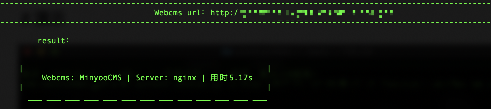

# cmsScan

___扒拉 bala bala bala ～___

## #介绍

**cmsScan基于特征匹配达到识别CMS的效果**    --- 字典库🐂🍺 cmsScan就🐂🍺

​	cmsScanWEB 正在赶来的路上 🐎 ～

## #运行

```shell
python3 cmsScan.py -u <URL> -f <字典文件> -t <线程，默认150线程>
=======
-u : 支持域名和IP http://127.0.0.1  #末尾去除 ‘/’
-f : 字典文件 格式： /pic/logo-tw.png|用友U8|133ddfebd5e24804f97feb4e2ff9574b
-t : 线程默认150
```

## #演示



